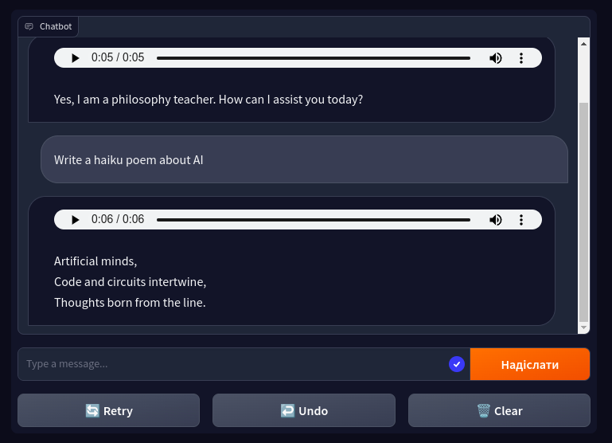

# TTS GPT

A text-to-speach wrapper for chatGPT using gTTS with Gradio UI.


## Quickstart
Provide your OpenAi API key as 

```
OPENAI_API_KEY = "sk-..."
```
The default context is a philosophy teacher. You can provide your own context in .env with
```
context = "..."
```

Build and run Docker 
```
docker build -t tts_gpt .
```
```
docker run -p 7860:7860 --rm tts_gpt
```
Access your demo at http://0.0.0.0:7860

## Screenshots
